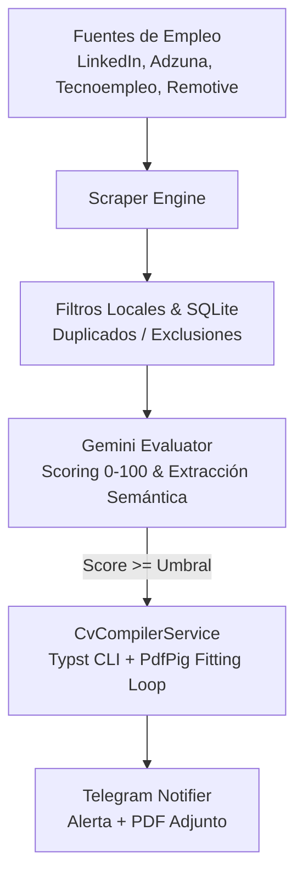

# CareerCopilot 🚀📄

CareerCopilot es una solución backend automatizada desarrollada en **C# sobre .NET 9 / ASP.NET Core** orientada a la prospección inteligente de empleo, evaluación de compatibilidad técnica mediante Modelos de Lenguaje Grande (LLMs) y compilación dinámica de currículums adaptados en PDF estricto de **1 página A4**.

El sistema monitoriza de forma periódica múltiples portales de empleo, analiza los requisitos de cada puesto frente a un perfil técnico exhaustivo, evalúa la afinidad candidato-vacante mediante la API de **Gemini** y compila un CV personalizado utilizando el motor tipográfico de alto rendimiento **Typst**, notificando al instante al usuario a través de un bot de **Telegram**.

---

## 🏗️ Arquitectura y Flujo del Sistema

El servicio opera mediante una arquitectura desacoplada y orientada a eventos periódicos:


1. **Scraping Concurrente:** El servicio consulta periódicamente las fuentes configuradas (LinkedIn Guest API, Tecnoempleo HTML scraping, Remotive API y Adzuna REST API), abstrayendo la normalización de entidades en un modelo común `JobOffer`.
2. **Deduplicación y Filtrado Local:** Se comprueba la persistencia local en SQLite para descartar ofertas ya evaluadas o títulos incompatibles mediante reglas de inclusión (`c#`, `.net`) y exclusión (`lead`, `senior`).
3. **Evaluación Semántica (Gemini API):** Las vacantes válidas son enviadas al motor de IA bajo un estricto protocolo *anti-alucinación*. El modelo extrae un score de afinidad (0-100), puntos fuertes, carencias y genera un extracto profesional junto a 4 viñetas de experiencia reordenadas según la prioridad de la oferta.
4. **Compilación Dinámica (Typst + PdfPig):** Se inyecta la información en una plantilla modular Typst. Un bucle de ajuste dinámico de tipografía (8.8pt a 7.6pt) evalúa el número de páginas con PdfPig para asegurar que el documento nunca exceda una única página A4.
5. **Notificación en Tiempo Real:** El bot de Telegram despacha un mensaje formateado con los detalles clave del puesto y adjunta directamente el archivo compilado con nomenclatura estandarizada: `CV_[Puesto]_Adrian_Espinola_Gumiel.pdf`.

---

## 🛠️ Tecnologías y Librerías

* **Core Runtime:** C# | .NET 9 | ASP.NET Core (`IHostedService` / Background Workers).
* **Persistencia:** SQLite | Entity Framework Core / Micro-ORM patterns.
* **Integración IA:** Gemini Generative AI REST API (Soporte multi-modelo con fallback automático ante cuotas 429)[cite: 8].
* **Generación de Documentos:**
  * [Typst CLI](https://typst.app/): Motor de tipografía moderno para maquetación vectorial determinista.
  * [PdfPig](https://github.com/UglyToad/PdfPig): Inspección estructural de páginas en memoria para garantizar el layout A4[cite: 7].
* **Comunicaciones & Scraping:** `HttpClientFactory`, expresiones regulares optimizadas y Telegram.Bot SDK.
* **Contenerización:** Docker multi-stage build optimizado sobre Linux con binarios independientes[cite: 7].

---

## ⚙️ Configuración y Variables

El sistema utiliza el archivo de configuración `appsettings.json` para gestionar el comportamiento del pipeline. Para entornos locales o despliegues, toma como base el archivo provisto `appsettings.example.json`:

```json
{
  "Logging": {
    "LogLevel": {
      "Default": "Information",
      "Microsoft.AspNetCore": "Warning"
    }
  },
  "JobSources": {
    "Adzuna": {
      "AppId": "TU_ADZUNA_APP_ID",
      "AppKey": "TU_ADZUNA_APP_KEY"
    }
  },
  "BotConfig": {
    "GeminiApiKey": "TU_GEMINI_API_KEY",
    "TelegramBotToken": "TU_TELEGRAM_BOT_TOKEN",
    "TelegramChatId": 123456789,
    "MinScoreThreshold": 70,
    "CheckIntervalMinutes": 60,
    "CandidateProfile": "Macroperfil detallado del candidato...",
    "RequiredKeywords": [ "c#", ".net", "backend" ],
    "ExcludedKeywords": [ "senior", "lead", "architect" ],
    "SearchQueries": [ "c# junior", ".net junior" ]
  }
}

```
# 🚀 #Despliegue y Ejecución
Opción 1: Ejecución Local (.NET CLI)
Requisitos Previos:

.NET 9 SDK instalado.

Typst CLI instalado y accesible desde el PATH del sistema[cite: 7].

Puesta en marcha:

Bash
# Clonar el repositorio
git clone [https://github.com/idarkar3000/CareerCopilot.git](https://github.com/idarkar3000/CareerCopilot.git)
cd CareerCopilot/CareerCopilot

# Configurar credenciales
cp appsettings.example.json appsettings.json
# (Editar appsettings.json con tus claves)
 
# 🤖 Comandos del Bot de Telegram
Además de emitir alertas automáticas, el servicio cuenta con un receptor asíncrono de comandos para interactuar con el pipeline en caliente:

/start o /help: Muestra las instrucciones de uso y comandos admitidos.

/status: Devuelve el número de ofertas almacenadas en la base de datos local y el estado de los servicios.

/run: Fuerza un ciclo inmediato de scraping y evaluación sin esperar al intervalo programado.

# 📄Licencia
Este proyecto está bajo la Licencia MIT. Consulta el archivo LICENSE para más información.
